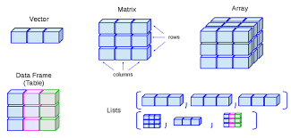

# Estructura de datos

En este 'repositorio' podras encontrar temas relacionados con 'estructuras' de datos implementadas en 
**java** como:

1. tipos de datos abtractos, 
2. recursividad, 
3. arreglos, 
4. generos, 
5. listasd 
6. pilas 
7. colas 
8. generos de ordenamiento y busqueda 
9. arboles 

